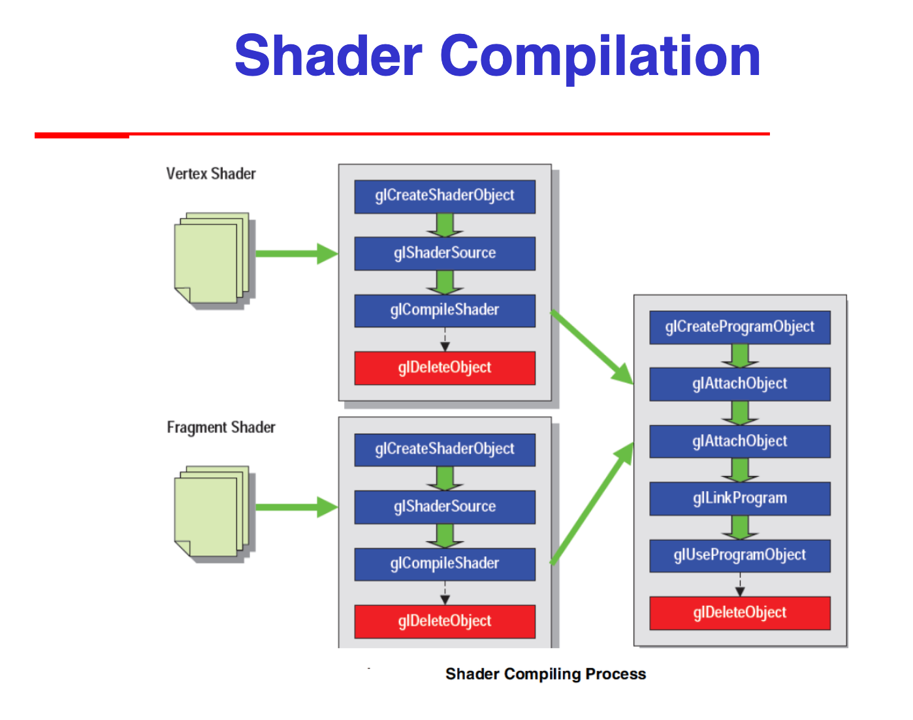

# Visualization Assignment

This is the assignment for the Visualization module for the course CSTE: CMV at Cranfield University.

The current features of the application is:

- Display port to display a surface mesh
- Save image as

# Contents

- [Uncertainties with the base project](#uncertainties-with-the-base-project)
  - [Overall structure](#overall-structure)
  - [Notes of the JS files](#notes-of-the-js-files)
    - [WebGLcontext-shadersNew.js](#WebGLcontext-shadersNew)
    - [WebGLbuffersNew.js](#WebGLbuffersNew)
    - [WebGLsurfacesNew.js](#WebGLsurfacesNew)
    - [WebGLdrawingFunctionNew.js](#WebGLdrawingFunctionNew)
    - [WebGLeventHandlersNew.js](#WebGLeventHandlersNew)
    - [WebGLchangingFunctionsNew.js](#WebGLchangingFunctionsNew)
    - [GUIhelpingFunctionsNew.js](#GUIhelpingFunctionsNew)
    - [WebGLObjectNew.js](#WebGLObjectNew)
    - [lena.js](#lena)
    - [gl-matrix.js](#gl-matrix)
    - [webgl-debug.js](#webgl-debug)
  - [Where do buffers come in?](#where-do-buffers-come-in)
    - [Shader compilation](#shader-compilation)
    - [Rendering pipeline](#rendering-pipeline)
      - [Frame buffer](#frame-buffer)
      - [Attributes, uniforms and varyings](#attributes-uniforms-and-varyings)
- [Usage](#Usage)
- [Maintenance](#Maintenance)
  - [Additional resources](#additional-resources)

# Uncertainties with the base project 

## Overall structure 

- The starting point of the app is in the `.html` file is the script is contained within it under `<script type="text/javascript">`.
- It contains objects that hold arrays for buffers, state of the model, event handling, displacement imags, current surface and other configuration related things.
  - The object `wGL` stores the arrays that will fill the different WebGL buffers and its size.
  - The object `Images` holds defaults and images, as well as error states such as the property `userImageOK`.
- The main function is `startup()` and it initialized things and it instantiates the WebGL context by calling the function [`createGLContext()`](#WebGLcontext-shadersNew.js).
- Shader
  - The function `gl.compileShader()` will compile the shader to then be linked.
  - The function `linkProgram()` creates executable versions of the shaders for the GPU.
  - The function `useProgram()` installs the program in the GPU if it contains valid code and is linked successfully.
- `onLoad`: I think the general structure is:
  - Get the WebGL context
  - Initialize the shaders
  - Initialize the buffers
  - Initialize the lights
  - Render the scene, which I think is constantly writing to the buffers first and then re-rendering.
    > I think this because of the `bindBuffer()` and the `bufferData()` functions that bind the vertices buffer, normal buffers and etc to a `gl.ARRAY_BUFFER` object and a `gl.ELEMENT_ARRAY_BUFFER` object.

## Notes of the JS files 

### WebGLcontext-shadersNew.js 

- The function `createGLContext(canvas)` has an empty catch block. Probably not good.
- `setupShaders()` configures the WebGL shaders
  - It also stores the positions of the WebGL attributes
  - Currently, it looks like the color attribute is commented out (`line 80`).

### WebGLbuffersNew.js 

- `setupBuffers(mode)` creates and calculates WebGL buffers. _What are these used for though?_

### WebGLsurfacesNew.js 

- Holds the functions to create parametric surfaces or superellipsoids.
- I think this will be the function triggered when the corresponding button is pressed.
  **TODO: Check if this function is triggered in the HTML file.**
- `defineSurface2()` is blank but it is supposed to be used to calculate the position and normal buffers for the specific parameteric surfaces.
- _How is `defineSurface3()` or `defineSurface4()` or `defineSurface5()` or `defineSurface6()` different to the previous one?_

### WebGLdrawingFunctionNew.js 

- `drawFigure()` draws the WebGL model.
- It checks the rendering mode and type of surface and draws the correct elements.
- _Where is this `State` object coming from?_
- It has one property called rendering. _Is this from WebGL or defined globally elsewhere?_ **It might be a WebGL context thing.**

### WebGLeventHandlersNew.js 

- Just a bunch of event listeners (i.e. key presses, or context-sensitivity), with model view navigation functions (i.e. zoom).

### WebGLchangingFunctionsNew.js 

- This is responsible for changes to base shapes. It changes it by generating a new shape and rendering that.
  - _What is the base shape? Is this where the first shape rendered on the screen updates?_
- It holds a switch case logic calling the functions `defineSurfaceX()` from the [`WebGLsurfacesNew.js`](#WebGLsurfacesNew.js) file.
- `changeImage2()`
  - _What is image number 9 represent? Is it the user input image?_

### GUIhelpingFunctionsNew.js 

- This holds the functions for inputing an image or downloading the webgl model to an image.

### WebGLObjectNew.js 

- This holds the base class called `Surf`, along with Plane, Sphere, Cone, Catenoid, Cylinder and Torus that extend it.
- This base class has functions to compute `U` and `V` and compute other points, normals, derivatives, face info, and indices.
  - _What is the parameter `n`? Is that the number that makes the mesh an NxN mesh?_
- It also holds the class `GLSData` that accepts a `Surf`, computes all the points, normals and etc, and can be used to compute things like the overall vertex info, normal info and etc, that is stored in a respective property in the class.
  - _Why are these functions important? Where are they used?_

### lena.js 

- _What is the point of this?_
- This holds an object called LenaJS, and a whole bunch of functions get added to it.
- It holds functions to apply filters and things using convolution.

### gl-matrix.js 

This looks like a library.

### webgl-debug.js 

This contains various functions for helping debug WebGL apps.

## Where do buffers come in? 

- Shaders are used to control the GPU rather, and it is done through shaders.
- The application's job is to send data to GPU and all rendering occurs there.
- `Vertices -> Vertex Processor -> Clipper and primitive assembler -> Rasterizer -> Fragment processor -> Pixels`

### Shader compilation 

### Rendering pipeline 

The webpage contains these components:

- Vertex Shader
- Fragment Shader
- Javascript code (holds the onLoad function)
  - getGLContext
  - initProgram
  - initBuffers
  - initLights
  - renderLoop -> drawScene
- HTML

#### Frame buffer 

The Frame Buffer is a 2D buffer that contains the fragments after processing by the fragment shader. Once all the fragments have been processed a 2D image is formed and displayed on the screen. The Frame Buffer is the end point of the rendering pipeline.

#### Attributes, uniforms and varyings 

These are three types used when programming shaders.

# Usage

Currently, open the `.html` in the browser.

Alternatively, use the live server plugin available on VSCode.

# Maintenance

This project is not planned to be supported past the submission on the 06 Apr 2020.

## Additional resources 

MDN web docs by Mozilla was invaluable during the development of the project.

- [WebGL best practices](https://developer.mozilla.org/en-US/docs/Web/API/WebGL_API/WebGL_best_practices)
